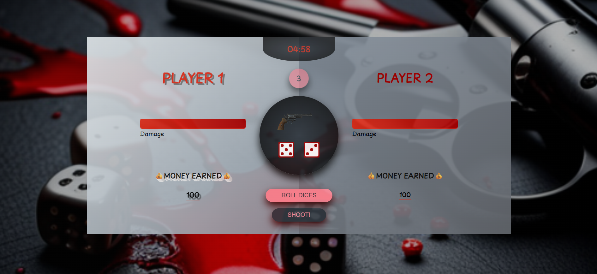

# Roulette Dice Game 🎲🔫




A **2-player strategy game** blending **Russian roulette** and **dice mechanics**.  
Test your luck against an AI opponent and survive the shootout! 💥

## 🎮 How to Play

1. Each player (You vs. AI) has **three chances** to roll two dice.
2. If the **sum** of the two dice equals **8**, you earn a chance to **pull the trigger**! 🔫
3. The gun might be **loaded** or **empty** — it's all about chance!
   - If it **fires**, your opponent takes damage.
   - If not, you just earn dice points.
4. The first player to reach **100% damage** loses.
5. If the **timer runs out**, the player with the **least damage** wins. ⏳🏆

> 🎯 Now powered by **AI opponent** logic.  
> 📱 Fully optimized for **mobile and desktop** gameplay!

## 🛠️ Technologies Used

- HTML
- CSS / Responsive Design
- JavaScript (Vanilla)
- Simple AI Logic

---

### 📌 Live Demo

[Roulette Dice Game](https://the-roulette-dice-game.netlify.app/)

---

## 🚀 Installation

1. Clone the repository:

   ```bash
   git clone https://github.com/auroraEros/roulette-dice-game.git
   ```

2. Open `index.html` in your browser and start playing! 🎮

---

Made with ❤️ by Sahar
